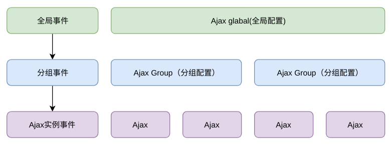

# Ajax 框架 request-h5

-   github: [https://github.com/szpoppy/request-h5](https://github.com/szpoppy/request-h5)

## 特点

-   事件模型驱动；
-   ajax 分组支持；
-   基于事件模型的拦截器，支持分组拦截器；
-   支持 promise；
-   灵活的默认配置，全局->分组->ajax；
-   短路径支持，方便统一切换接口路径；
-   提供实时获取服务器时间方法；
-   jsonp 和 fetch 支持。

## 安装

-   npm install request-h5 -- save

##　全局属性配置

```js
// 全局属性设置
request.global.setConf(options);

// 全局事件监听（拦截器）
request.global.on("open", function(req) {});

// 全局事件销毁
request.global.on("open");
```

## 添加分组

```js
// 新增分组
let ajax = request.Request();

// 设置此分组的属性
ajax.setConf(options);

// 此分组事件监听（拦截器）
ajax.global.on("open", function(req) {});

// 此分组事件销毁
ajax.global.on("open");

// 快捷方式调用
ajax.get(url, callback, param);
ajax.post(url, callback, param);
ajax.put(url, callback, param);
ajax.jsonp(url, callback, param);
```

## Promise 支持

```js
// 调用then方法，返回一个Promise
ajax.get(url, callback, param).then([callback]);

// 直接使用 fetch
ajax.fetch(options);
```

## 短路经

```js
// 设置短路经
ajax.setConf({
    paths: {
        webapi: "/api/function/"
    }
});

// 使用短路经
// url webapi:query => /api/function/query
ajax.get("webapi:query", callback, param);
```

## 服务器事件自动获取

```js
// 返回当前服务器时间（同步）
ajax.getDate();
```

`注意：`

-   获取正确的服务器事件，必须有一次 ajax 请求后才能正确获取；
-   默认获取 ajax 中 response.header.Date，并保持；
-   获取服务器事件，采取本地事件和服务器时间差来计算出服务器时间。

## options 支持参数说明

| 名称            | 说明                                          | 默认值      |
| --------------- | --------------------------------------------- | ----------- |
| baseURL         | 基础 url 路径                                 | 空字符串    |
| paths           | 短路径(替换 url 中的短路径)                   | 空对象      |
| useFetch        | 是否使用 fetch,如果浏览器不支持，则降级为 xhr | true        |
| url             | 请求 url，支持短路径                          | 空字符串    |
| method          | 请求方法                                      | GET         |
| dataType        | 请求数据格式                                  | querystring |
| resType         | 返回数据格式                                  | json        |
| param           | 请求参数                                      | null        |
| header          | 请求头设置                                    | null        |
| jsonpKey        | jsonp 请求是需要的 key                        | callback    |
| cache           | get 请求是否有缓存                            | true        |
| withCredentials | 跨域带上 cookie                               | false       |

## 事件参数 req 说明

| 名称            | 说明                                  | 默认值                                          |
| --------------- | ------------------------------------- | ----------------------------------------------- |
| outFlag         | ajax 已经中止，内部使用               | false                                           |
| method          | 请求方法                              | GET                                             |
| url             | 请求 url                              | 空字符串                                        |
| orginURL        | 保存的是原始传入的 url                | url                                             |
| formatURL       | 格式化后（最终使用的）的 url          | 短路径 -> 全路径                                |
| path            | 短路径目录截取值                      | 短路径 url 开头处 : 前面的字符，默认为 空字符串 |
| cache           | get 请求是否有缓存                    | true                                            |
| resType         | 请求类型                              | 空字符串，默认为 querystring                    |
| isFormData      | 是否为 FormData 数据，针对非 GET 请求 | 按照 param 类型数据自动判定                     |
| param           | 请求参数                              | 空对象                                          |
| header          | 请求头                                | 空对象                                          |
| baseURL         | 基础 url 路径                         | 空字符串                                        |
| isCross         | 是否跨域                              | 按照 url 路径自动判断                           |
| xhr             | xhr 请求的对象                        |                                                 |
| withCredentials | 跨域带上 cookie                       | false                                           |

## 事件参数 res 说明

| 名称           | 说明                          | 默认值                    |
| -------------- | ----------------------------- | ------------------------- |
| withReq        | req 的引用                    | req                       |
| root           | this 引用                     | Ajax                      |
| err            | 错误内容                      | 默认为 null，便是正确返回 |
| json           | json object                   | 空对象                    |
| text           | 获取到的字符串                | 空字符串                  |
| result         | 返回内容                      |                           |
| getHeader(key) | 获取 key 对应的 header        | null                      |
| cancel         | 验证节点设置为 true，中止回调 | false                     |
| status         | 状态吗                        | 0                         |
| getDate()      | 获取服务器时间                |                           |
| getJSON(key)   | 获取 res.json 中的子字符串    |                           |
| jsonKey        | jsonKey 中的对象              | json                      |

## ajax流程图


## 三层分组模型
